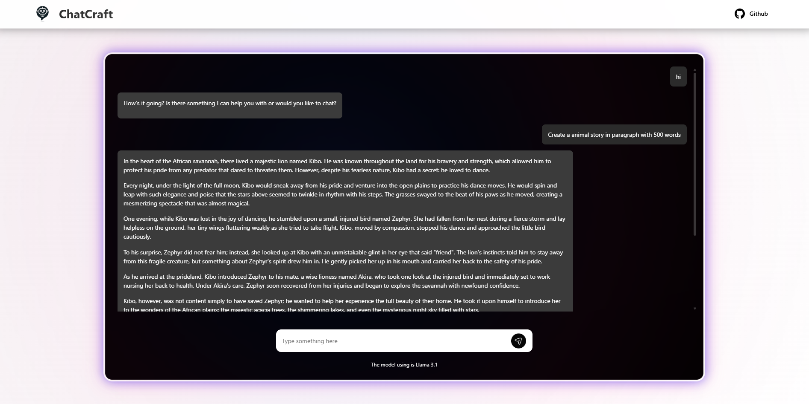

# 🤖 ChatCraft - AI Chat Interface



## 🌟 Superflex Hackathon Project

Welcome to **ChatCraft**, a sleek and interactive AI chatbot interface built with **Superflex**! It combines modern design principles with smooth animations to create an engaging user experience.

## 🗝️ Key Features

- **Dynamic Chat Interface**: A responsive and interactive chat window.
- **Superflex-Powered UI**: Built entirely using Superflex, with no manual HTML or CSS.
- **Lightweight AI Integration**: Connects to a simple, memory-efficient AI model for conversations.
- **GitHub Integration**: Easy access to the project repository.

## 🔧 Technical Stack

- **Frontend**: HTML5, CSS3, JavaScript
- **Styling**: Pure CSS with custom animations
- **AI Integration**: Ollama API with Llama 3.1 Model
- **API Endpoint**: Local Ollama server (port 11434)
- **Version Control**: Git

## 🚀 How Superflex Helped

Superflex played a crucial role in simplifying the development process for ChatCraft. Here’s how:

1. **No HTML/CSS Code**: Superflex eliminated the need to write and maintain HTML and CSS, allowing us to focus on functionality and user experience.
2. **Rapid UI Iteration**: Superflex enabled quick prototyping and iteration of the chat interface, saving valuable development time.
3. **Customization**: Superflex provided full customization options, making it easy to tweak the design without diving into complex CSS.
4. **Accessibility**: Superflex ensured that the UI was accessible and responsive out of the box.

## 🎈 Why ChatCraft?

ChatCraft is a perfect example of how Superflex can revolutionize frontend development. By leveraging Superflex, we were able to:

- Build a professional-grade UI in record time.
- Eliminate the complexities of traditional HTML and CSS.
- Focus on creating a delightful user experience.
- Integrated with AI-Powered Chatbot Functionality

## ✨ Getting Started

To run ChatCraft locally, follow these steps:

1. **Clone the Repository**:
   ```bash
   git clone https://github.com/MarcusMQF/chatcraft.git
   cd chatcraft
   ```

2. **Install Dependencies**:
   ```bash
   npm install
   ```

3. **Install Ollama**:
   - Follow the installation instructions at [Ollama's official website](https://ollama.ai)
   - Pull the Llama 3.1 model using: `ollama pull llama3.1:8b`

4. **Start the Servers**:
   - Start Ollama server: `ollama serve`
   - In a new terminal, start the Node server: `node server.js`
   - Both servers should be running simultaneously

5. **Access the Application**:
   - Open your browser and go to: `http://localhost:3000` 
   (or whatever port you've configured in server.js)

6. **Verify Setup**:
   - Check that the chat interface loads
   - Ensure both servers are running:
     - Ollama API at `http://localhost:11434`
     - Node.js server at `http://localhost:3000`

## 📝 License

This project is licensed under the MIT License - see the [LICENSE](LICENSE) file for details.

---
Built with ❤️ for the Superflex Hackathon